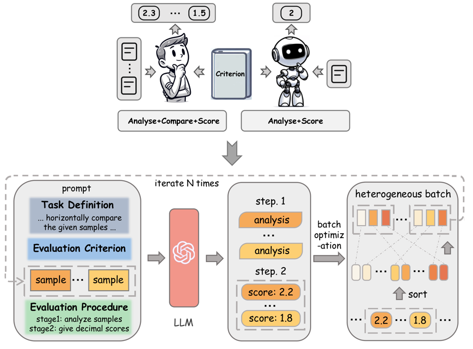
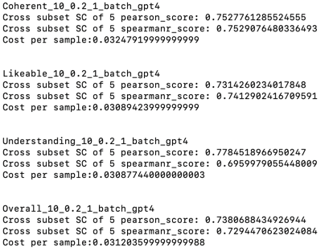
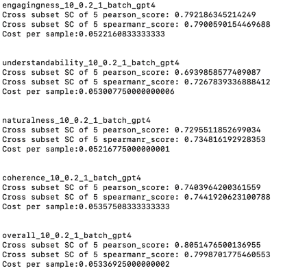
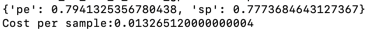
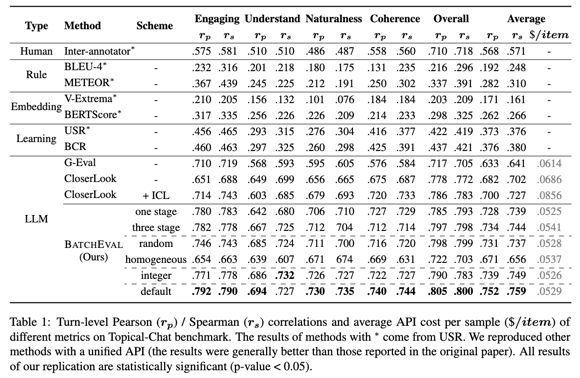
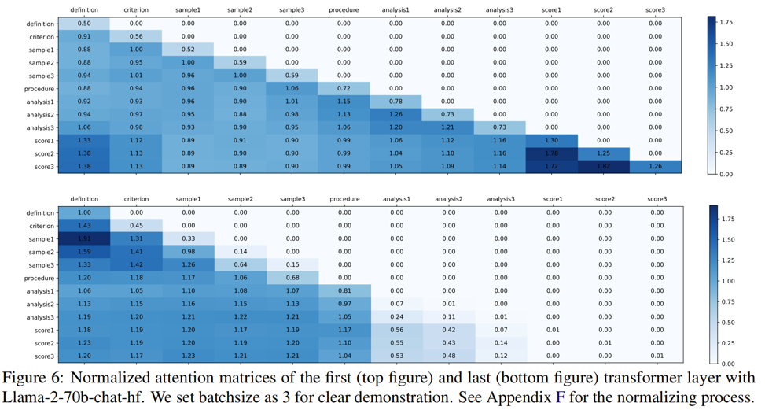

# BatchEval: Towards Human-like Text Evaluation

 
#### Significant progress has been made in automatic text evaluation with the introduction of large language models (LLMs) as evaluators. However, current sample-wise evaluation paradigm suffers from the following issues: (1) Sensitive to prompt design; (2) Poor resistance to noise; (3) Inferior ensemble performance with static reference. Inspired by the fact that humans treat both criterion definition and inter sample comparison as references for evaluation, we propose **BatchEval**, a paradigm that conducts batch-wise evaluation iteratively to alleviate the above problems. We explore variants under this paradigm and confirm the optimal settings are two stage procedure with heterogeneous batch composition strategy and decimal scoring format. We study variations in the evaluation procedure, the format of scoring and the composition of batch to validate the optimal settings. Comprehensive experiments across 3 LLMs on 4 text evaluation tasks demonstrate that **BatchEval** outperforms state-of-the-art methods by 10.5% on Pearson correlations with only 64% API cost on average.  Further analyses have been conducted to verify the robustness, generalization, and working mechanism of **BatchEval**.

### The repo contains:
- Code for conducting **BatchEval** and testing the results of **BatchEval** ([Run_data](Run_data)).
- Data of our results ([Provided_Result](Provided_Result)).
- The experimental results.

### Testing Results of **BatchEval**
#### Results on FED-Dialog
> python BatchEval/Provided_Result/calulate_fed.py

#### Results on USR-Topical-chat
> python BatchEval/Provided_Result/calulate_usr.py

#### We additionally test **BatchEval**-GPT-4-turbo on FED-Dialog-Coherent
> python BatchEval/Run_data/calulate_fed.py

## Conducting **BatchEval** on USR or FED
Set your API key in 'BatchEval/Run_data/Get_fed_batch.py' or 'BatchEval/Run_data/Get_usr_batch.py' and directly run it.

## Conducting **BatchEval** on Your Dataset

### step1:
prepare your data in the format of "BatchEval/Run_data/eval_data_new/generate_fed_dialog_heterogeneous_coh/0.json". Store it in a similar way.

### step2:
prepare your prompt like 'BatchEval/Run_data/prompts/fed_dialog/coh_analyze_batch.txt' and store it in 'BatchEval/Run_data/prompts/[your dataname]/[your criterion]_analyze_batch.txt'

### step3:
Follow 'BatchEval/Run_data/calulate_fed.py' to rewrite your script and set your API

### step4:
Run your script

### step5:
Evaluate your result with 'BatchEval/Run_data/calulate_fed.py'

## Results

## Attention matrices with Llama2-70b-chat-hf

